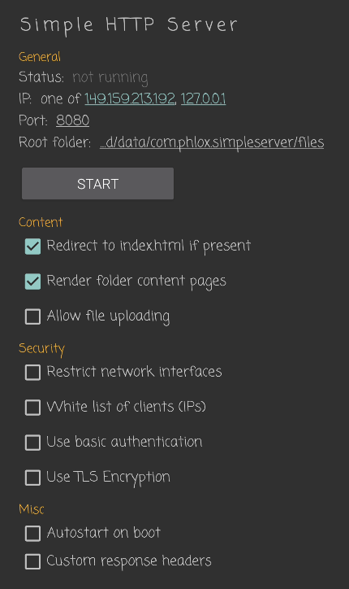
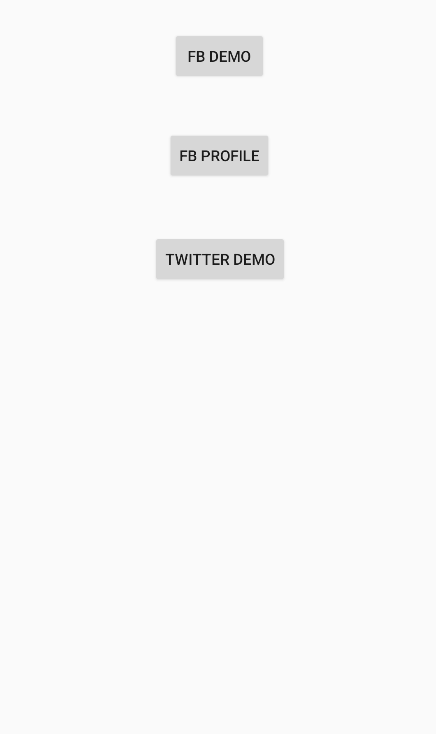
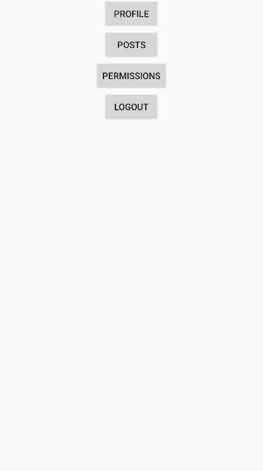

## Table 2 result reproduce
### Prepare
0. We update the Github repository: https://github.com/PESP-privacy-preserving-social-SDK/PESP/tree/4bc46432039b292ee9ee25e1e6e79697747ca167.

1. Install the simple httpserver on AVD for mocking the developer's own server that is in the endpoint allowlist.
`adb -s emulator-5554 install './Simple HTTP Server_1.9.0_apkcombo.com.apk'
` 
To install the apk on real devices, please use `adb devices` to find the device serial first and then replace "emulator-5554" with the serial.

2. Launch the installed http server apk and start listening on port 8080


3. Launch the client-app project in Android Studio

4. Collecting the log manually for each use cases in table 2.


### Reproduce FB login result in table2:
0. Open logcat in Android Studio (View > Tool Windows > Logcat), filter with keywords: fblogin_evaluation

1. Click "FB Demo" button. The app navigates to a new activity after clicking


2. Swipe back from the left, the app navigates back to the main activiy after swiping.


3. Observe the logcat, two lines of log should be printed similar to the following example:
```
2023-09-24 17:48:22.960 3135-3135/com.demo.client.app.first E/evaluation: fblogin_evaluation start
2023-09-24 17:48:23.029 3135-3180/com.demo.client.app.first E/evaluation: fblogin_evaluation end
```

4. Repeat step 1-3 for 20 times to collect 40 lines of logs.

5. Copy paste the 40 lines of logs in to file "login_migrated_log.txt"

6. Move file login_migrated_log.txt to folder /evaluation-table-data/table2

7. Run script 
`python3 gen_table2_fblogin.py`

8. The result may be different but close to table 2 facebook login pesp migrated result, the difference can be caused by AVD/Device.


### Reproduce Facebook Profile result in table2:
#### Step1: get pesp_fbprofile_log.txt
0. Open logcat in Android Studio (View > Tool Windows > Logcat), filter with keywords: fbprofile_evaluation

1. Click "FB FROFILE" button. The app navigates to a new activity after clicking

2. Swipe back from the left, the app navigates back to the main activiy after swiping.

3. Observe the logcat, two lines of log should be printed similar to the following example:
```
2023-09-24 18:51:36.816 6311-6311/com.demo.client.app.first E/evaluation: fbprofile_evaluation start
2023-09-24 18:51:36.853 6311-6311/com.demo.client.app.first E/evaluation: fbprofile_evaluation end
```

4. Repeat step 1-3 for 20 times to collect 40 lines of logs.

5. Copy paste the 40 lines of logs in to file "pesp_fbprofile_log.txt"

6. Move file pesp_fbprofile_log.txt to folder /evaluation-table-data/table2

#### Step2: get baseline_fbprofile_log.txt
7. Open the facebook-android-sdk-main and Launch the samples.FBLoginSample project in Android Studio

8. Click "FB FROFILE" button. The app navigates to a new activity after clicking, if not logged in, click "continue with Facebook" and complete the login process.

9.  Swipe back from the left, the app navigates back to the main activiy after swiping.
    
10. Click "Logout" button. the app should logout and click "continue with Facebook" and complete the login process.
    
11. Open logcat in Android Studio (View > Tool Windows > Logcat), filter with keywords: evaluation
    
12. Observe the logcat, four lines of log should be printed similar to the following example:
```
2023-09-24 18:41:25.489 29953-29953/com.facebook.fbloginsample.second E/evaluation: FBProfile view start
2023-09-24 18:41:25.542 29953-29953/com.facebook.fbloginsample.second E/evaluation: FBProfile view end
```

12. Repeat step 8-10 for 20 times to collect 40 lines of logs.

13. Copy paste the 80 lines of logs in to file "baseline_fbprofile_log.txt"

14.  Move file baseline_fbprofile_log.txt to folder /evaluation-table-data/table2

#### Step3: run script
15. Run script 
`python3 gen_table2_fbprofile.py `

1.  The result may be different but close to table 2 Display User Profile row result, the difference can be caused by AVD/Device.


### Reproduce Twitter Login result in table2:
#### Step1: get pesp_twlogin_log.txt
0. Open logcat in Android Studio (View > Tool Windows > Logcat), filter with keywords: twitterlogin_evaluation

1. Click "TWITTER DEMO" button. The app navigates to a new activity after clicking

2. Swipe back from the left, the app navigates back to the main activiy after swiping.

3. Observe the logcat, two lines of log should be printed similar to the following example:
```
2023-09-24 19:53:22.080 11253-11253/com.demo.client.app.first E/evaluation: twitterlogin_evaluation start
2023-09-24 19:53:22.153 11253-11321/com.demo.client.app.first E/evaluation: twitterlogin_evaluation end
```

4. Repeat step 1-3 for 20 times to collect 40 lines of logs.

5. Copy paste the 40 lines of logs in to file "pesp_twlogin_log.txt"

6. Move file pesp_twlogin_log.txt.txt to folder /evaluation-table-data/table2

#### Step2: get baseline_twlogin_log.txt
7. Open the facebook-android-sdk-main and Launch the samples.FBLoginSample project in Android Studio.

8. Click "Login with Twitter" button. The app navigates to a new activity after clicking.

9.  Swipe back from the left, the app navigates back to the main activiy after swiping.
    
10. Open logcat in Android Studio (View > Tool Windows > Logcat), filter with keywords: twlogin_evaluation
    
11. Observe the logcat, three lines of log should be printed similar to the following example:
```
2023-09-24 19:39:04.338 9847-9847/com.facebook.fbloginsample.first E/evaluation: twlogin_evaluation start
2023-09-24 19:39:04.979 9847-9847/com.facebook.fbloginsample.first E/evaluation: twlogin_evaluation network end
2023-09-24 19:39:04.980 9847-9847/com.facebook.fbloginsample.first E/evaluation: twlogin_evaluation end

```

12. Repeat step 8-10 for 20 times to collect 60 lines of logs.

13. Copy paste the 60 lines of logs in to file "baseline_twlogin_log.txt"

14.  Move file baseline_twlogin_log.txt to folder /evaluation-table-data/table2

#### Step3: run script
15. Run script 
`python3 gen_table2_twitter.py `

16. The result may be different but close to table 2 Login with Twitter row result, the difference can be caused by AVD/Device.

Note that we intenionally let the twitter login fail to aviod introducing time overhead casued by network traffic between the app and Twitter server.